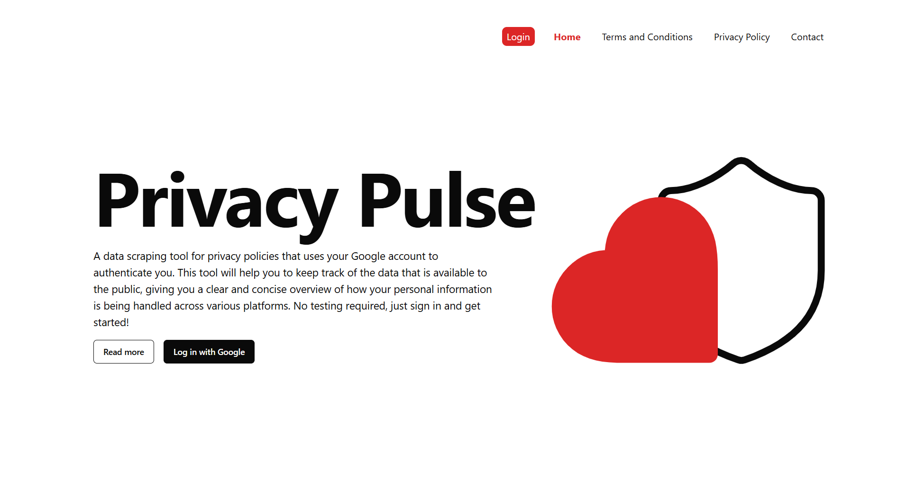

# **Privacy Pulse - Data Privacy Awareness App**

         

This application helps users understand their digital presence by scraping data available online and offering insights into how much personal information is publicly accessible. The app aims to raise awareness of social engineering risks and digital privacy.

## **Demonstration video**  
[](https://youtu.be/UJbkOmh8h0Q)
---

## **Project Structure**
The app follows a multi-repository structure with the following components:

1. **Frontend:** A React application providing the user interface.  
2. **Authentication Service:**  Handles Google OAuth login functionality (.NET).  
3. **Data Services:** Two microservices responsible for data scraping and providing data to the frontend (.NET and JavaScript).  
4. **Infrastructure:** Terraform scripts required to deploy and manage infrastructure for all services (Terraform).  

---

## **Deployment Pipeline Anatomy**
The deployment pipeline follows Continuous Delivery principles with the following stages:

- **Build:** Uses production Docker images, except for the frontend, where a custom base image is pulled and pushed to the GitLab registry.  
- **Test:** Includes unit testing for the authentication and data services (frontend testing was done manually).  
- **Deployment:**
  - Automatic deployment to staging after successful tests.  
  - Manual promotion to the production environment after validation in staging.  

Pipeline architecture ensures that staging closely mirrors production, reducing bugs and deployment issues.

---

### **Steps to Run Locally**
1. Clone the respective repositories for frontend, authentication, and data services.
2. Build and run services using Docker and Skaffold:
   ```bash
   skaffold dev
   ```
3. Use Vite for frontend development:
   ```bash
   npm install
   npm run dev
   ```

---

## **System Architecture**
The system follows a microservices architecture deployed on Kubernetes with Skaffold for automated builds and deployments. Services communicate through RESTful APIs.

---

## **Development Tools and Team Practices**
- **Design:** Figma  
- **Planning:** Trello  
- **Communication:** Slack, Discord  
- **Version Management:** GitHub  
- **Development Environment:** VSCode  

---

## **Testing**
- **Authentication and Data Services:** Unit tests executed during pipeline.  
- **Frontend:** Manual testing and stress testing using Locust to simulate concurrent user requests.  

---

## **Key Features**
- **Google OAuth Login:** Secure user authentication with Google accounts.  
- **Account Overview:** Displays personal information based on scraped data.  
- **Scraping Service:** Analyzes publicly available user data.  
- **User Data Visualization:** Interactive insights into data exposure.  
- **Responsive Design:** Optimized for various screen sizes.  

---

## **User Stories**
- ✅ As an end user, I want to log in to the app with my Google account.  
- ✅ As an end user, I want to see my profile information.  
- ✅ As an end user, I want to access detailed insights into my publicly available data.  

---

## **Authors**
- Vanja Maric
- Anna Manole
