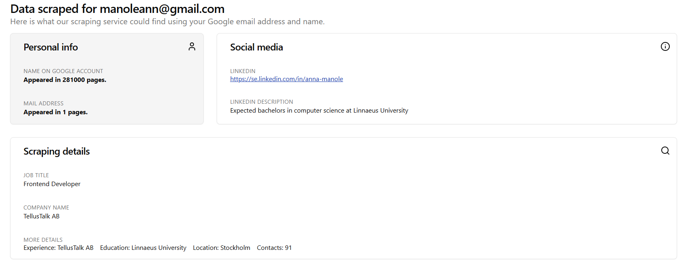

# Post Mortem

## Title of project, authors, and date
Privacy Pulse, Anna Manole and Vanja Maric, 08/01/2025.

## Abstract

This report explains the process of setting up, hosting, and developing a cloud-native application consisting of several microservices on a Kubernetes environment. The process involved several steps and experience with cloud-native applications, requiring compromises to reach an MVP (minimum viable product). The final solution successfully demonstrates the feasibility of using Kubernetes for microservices, with lessons learned for further optimization.

## Introduction and background

The final product, called Privacy Pulse, is a web application where users can log in with their Google account and scrape publicly available data about themselves. By using the application, a user can see how many times their name and email appear online, as well as any associated social media accounts connected to their personal info (name, city of residence, college). Additional information such as job title and company details may also be found.

{width=1275 height=491}
_Picture of a user's profile with data found after using the scraping service_

The goal of the product is to raise awareness of privacy concerns regarding online presence, enabling users to take action if their data generates numerous search results, particularly those revealing sensitive information.

The project consists of several microservices: a data scraping microservice, a data transfer microservice to the application via a queue, and an authentication service. The frontend application, designed with React and shadcn components for a modern look, focuses on user experience. User login information is stored in a PostgreSQL database, and each time the scraping microservice is called, a new entry is appended to the user's record, establishing a one-to-many relationship.

## Positive experiences

The positive experiences come from designating parts of the application to project members. Communication and teamwork also worked well, as we were able to solve problems together and advance the development process. In the future, we can replicate this by maintaining a good tone with our colleagues and being transparent about blockages, seeking help in areas outside our expertise.

The design of the application went smoothly due to the initial prototyping in Figma, and using shadcn components ensured consistency. This approach helped create a cohesive and user-friendly interface for the frontend, aligning with our goal of enhancing user experience. 

Additionally, the integration of several microservices, including scraping, data transfer, and authentication, was facilitated by clear task distribution and effective use of Kubernetes for managing the microservices architecture. This modular approach allowed for scalability and easier management of individual components.

## Negative experiences

In our opinion, the negative experiences stem from setting a very broad project scope without fully understanding the limitations of such an application or having enough experience in data scraping. Scraping data was done through a Google API, which has a limit of 100 API calls per day in the free tier. Additionally, the results from the API were mostly irrelevant. Several other methods of scraping were tested, such as using fetch to query results on Google or using Puppeteer. Even though these methods produced links, social media profiles were often protected by API restrictions, which, when considering the bigger picture, is a positive aspect for privacy concerns.

Another setback was the lack of experience with cloud-native applications and Kubernetes as a whole. We encountered several blocking moments, including setting up ingress for the microservices, hitting Docker pull image limits, restricted access to the LNU cloud through VPN, and managing the deployment configurations effectively. Troubleshooting these issues required significant time and effort, which slowed down the progress of our project.

The complexity of integrating multiple microservices made the project more challenging, especially in making sure they communicated reliably and handled errors smoothly. Our limited knowledge of best practices for deploying and scaling microservices in Kubernetes added to these difficulties, sometimes causing inefficient resource use or instability in the application.

To avoid these issues in future projects, we could start with a more focused scope, ensuring we have a solid understanding of the technologies and limitations involved. We could also allocate time for learning and experimenting with unfamiliar tools, such as Kubernetes, before fully integrating them into the project. Better planning and incremental testing of each component could help us identify and address potential issues earlier in the development cycle.

## Summary 

This report reviewed our experience building a cloud-native application with microservices on Kubernetes. We learned that good communication and clear task distribution helped move the project forward. However, challenges like limited experience with data scraping and Kubernetes slowed us down, teaching us the importance of setting realistic goals and learning new technologies.

Looking ahead, we can improve both our skills and the product by refining our processes and exploring better data scraping methods and cloud infrastructure, allocating more time for project setup and experimenting with different techniques.