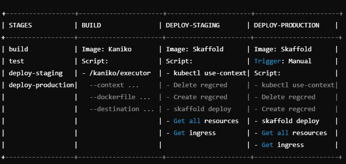

# Link to start URL of the application
https://cscloud8-111.lnu.se/
# Deployment pipeline anatomy

# Continuous Delivery principles adopted

## Branching strategy and merging
For all the repositories, we will be working inside the "development" branch while locally hosting the cluster with Skaffold. Developers will make changes in the development branch, and when those changes are ready, a merge request will be created to merge into the "main" branch. Once the changes are merged into main, the application will be automatically deployed to the staging environment. The staging environment mirrors the production environment to ensure consistency between the two. This process allows us to test changes in an environment that behaves similarly to production. If everything looks good and all tests pass, we will manually promote the changes to the production environment by triggering a manual deployment process.
The staging environment is hosted at https://cscloud8-111.lnu.se/staging/ and the production environment is hosted at https://cscloud8-111.lnu.se/.

## Repository 
The repository is a multi repo and consist of 4 repositories:
- Frontend: the React application;
- Authentication: the O-Auth Google login feature;
- Data Services: consists of 2 microservices - the data scraper and data service (that the frontend calls);
- Infrastructure: the terraform scripts required to build the infrastructure for all the services;

## Team practices 

### Meetings
Fridays: Stand-up where we present what we have done, plan on doing and any issues we may have encountered. Here we also discuss the results from user testing (if any). On Slack as needed and considering our planning. 

### Tools
- Figma: design
- Trello: planning
- Slack, Discord: communication
- Gitlab: version management, pipelines
- VSCode: source code

# Design
## Persona

Emma is a 23-year-old student from Stockholm who is passionate about digital privacy and technology. She enjoys drinking coffee and often spends time at cafés where she can read or work on her projects. She doesn't have many close friends but deeply values the relationships she has. When she's not studying or reading about cybersecurity, Emma likes to be creative by trying out new recipes in the kitchen or working on small projects at home. She has a relaxed style and prefers to keep things simple, both in her digital life and her everyday routine. Emma is looking for practical ways to protect her personal information and feel secure online.

**Motivations:**
- Protect her personal privacy and digital presence.
- Prevent her information from being exploited in data breaches or fraud.
- Feel safer online.

**Frustrations:**
- Lack of time to manually keep track of her online data.
- Worry that sensitive information could end up in the wrong hands without her knowledge.
- Difficulty managing multiple accounts and passwords.

**Goals:**
- Gain a clear overview of her digital presence and risks.
- Be able to respond to potential threats or leaks.

## User Interface Design
### Landing page

### Login popup

### Account overview and scaping service

### User data

## Architectural overview of the system

### User stories 

- As Emma I  want to be able to log in into the App with my Google account
- As Emma I want to see my profile
- As Emma I want to be able see my data if it is available
- As Emma I want to be able to scrape public data associated with my Name and email
- As Emma I want to be able to log out from the App

### Diagram

## Microservices

- Frontend: Handles user interactions.
- Auth Service: Manages authentication via OAuth2.
- Data Service: Processes and manages data.
- Data Scraper: Responsible for gathering external data.
- Supporting Components: Message Broker: Facilitates asynchronous communication.

## Communication protocols and patterns (e.g., HTTP, queues)

### Synchronous Messaging Pattern (Request-Response)
Direct HTTP-based communication:
Frontend → Data Service
Frontend → Auth Service
Auth Service → External API

### Asynchronous Messaging Pattern (Request-Reply)
Asynchronous communication with message queues:
Data Service → Data Scraper

## Data persistency

### Stack
- React: used for frontend.
- Express: used for scraper service.
- .NET: used for data service/OAuth service.
- Postgres: Centralized database for storing application data.
- Redis: Used for caching, optional.

### Principle
Replication of database where we share Database with CQRS: Keep one database for all but add read replicas to boost read performance if needed.
