# Link to start URL of the application
https://cscloud8-111.lnu.se/
# Deployment pipeline anatomy

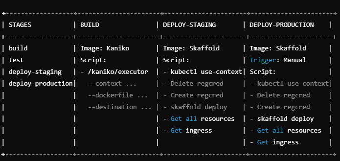

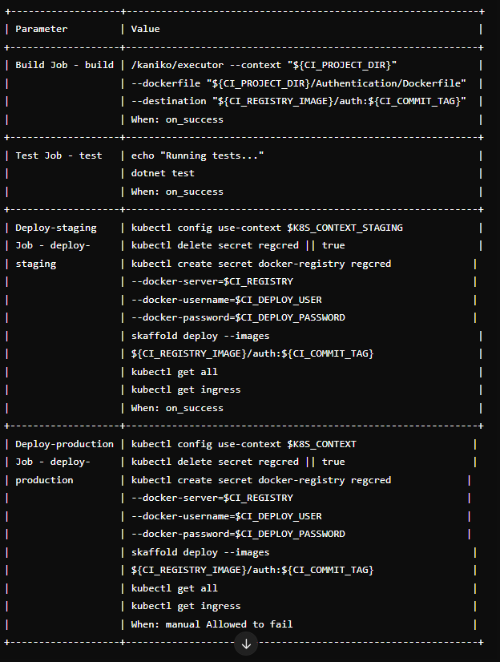{width=468 height=620}

The pipeline on the auth service and data service repositories are similar, with the only exception being that there is a "test" stage after the build stage for unit testing.

### _Reflection of the outcome_

Each repository comes with a gitlab-ci.yaml file which specifies how the pipeline is configured, including the stages, jobs, and scripts to be executed for building, testing, and deploying the application, as well as any environment-specific configurations, such as deployment targets, variables, or secret management. 

The build stage specifies the image from Dockerfile.production, except for the frontend where we had to pull a custom base image locally from Docker Hub (e.g., node:20.8.0-bullseye-slim), tag it with our GitLab registry, and push it to our GitLab repository. This custom image is then referenced in the Dockerfile by updating the FROM line to point to the newly tagged image from our GitLab registry. In the .gitlab-ci.yml file, we added a step to configure Docker authentication and ensure that the pipeline can pull from both the GitLab registry and Docker Hub, which is necessary for deploying our application successfully. Additionally, we set up the required environment variables and created a DockerHub token for secure access. This was done because often deployments in frontend exceeded pull rate limit imposed by Docker Hub.

The test stage was done for the authentication service and data-services repositories. Unit tests were executed to verify core functionality and ensure no regressions. If the tests fail, the pipeline stops immediately, and the issues are investigated. The developer reviews the test reports, identifies the root cause, and fixes the code before re-running the pipeline to ensure all tests pass successfully. The frontend repository has no testing stage. Testing here was done manually by using the UI. We also stress test the frontend using locust, by simulating a number of requests happening simultaneously. 

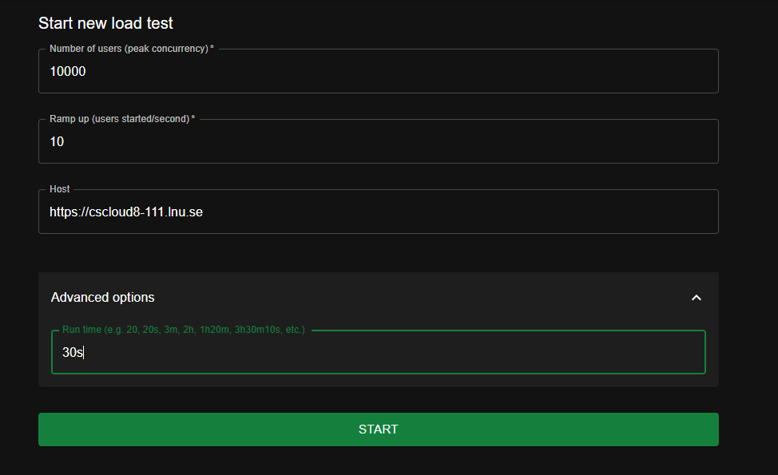{width=731 height=447}

_Locust stress test parameters on production_ 

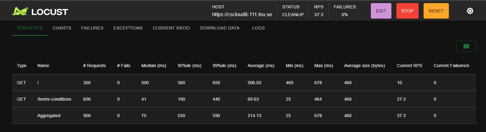{width=1168 height=319}
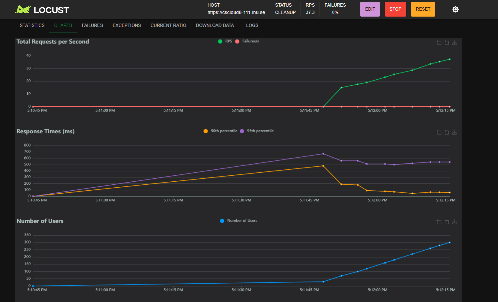{width=1120 height=682}
_Results of the stress test_

The final step is deployment which is done automatically to the staging cluster after testing (if any). After that if everything works as intended on the staging cluster, the final step is deploying to the production cluster which is done manually. This process allowed us to test changes in an environment that behaves similarly to production, without introducing bugs or problems in production. In this way, after the automatic testing was done, we had an extra layer of safety in place.

# Continuous Delivery principles adopted

## Branching strategy and merging

We have worked in parallel in different repositories, thus different branches were not needed for development. In this project we used two different clusters: staging and production. 

The staging environment mirrored the production environment to ensure consistency between the two. If everything looked good and all tests pass, we manually promoted the changes to the production environment by triggering a manual deployment process.

The staging environment is hosted at https://cscloud8-134.lnu.se/ and the production environment is hosted at https://cscloud8-111.lnu.se/.

### _Reflection of the outcome_
The original plan was to use two different namespaces inside one cluster. We started adding "/staging" to the endpoint of the staging namespace, but because there was no "/production", the production namespace overrode the staging namespace. This was confusing, but we did not want to modify the production URL by appending "/production" to every link. We agreed that it was clearer to have a separate URL for the staging and production environments, thus opting for two different clusters. We could use the same deployments and resources in the staging cluster initially, observe if the changes function effectively in a simulated production environment, and then manually deploy to production. This approach is preferable because different endpoints could easily be accessed by any end user if both production and staging were on the same URL. The staging URL could be kept confidential or in the future secured by implementing authentication or network restrictions.

## Repository 
The repository is a multi repo and consist of 4 repositories:
- Frontend: the React application;
- Authentication: the O-Auth Google login feature;
- Data Services: consists of 2 microservices - the data scraper and data service (that the frontend calls);
- Infrastructure: the terraform scripts required to build the infrastructure for all the services;

### _Reflection of the outcome_
The 4 repositories were challenging to set up at first, so we started in the frontend. There, we added ingress for the frontend, but also for the microservices that required API endpoints for the frontend to access (data service and authentication service). After we did that, we could replicate the same structure (minus setting the ingress) in all the other repositories. Each repository has a k8s folder, which contains Kubernetes manifests such as Deployment, Service, and ConfigMap YAML files for managing the resources. For example, in the data-scraper folder from the data-service repository, the k8s folder includes scraper.yaml, which defines the deployment of the data-scraper service. This manifest specifies the number of replicas, the container image, environment variables, and any necessary init containers, like waiting for RabbitMQ.

The skaffold.yaml file, located in the root of the repositories configures the build and deployment process for the services. It includes details on building Docker images for the microservices using their respective Dockerfiles (for production) and deploying the raw Kubernetes YAML manifests for microservices such as rabbitmq, data-service, and data-scraper. The deploy section specifies that Kubernetes resources should be applied using kubectl.

This development process allowed us to establish a consistent structure across all repositories. By starting with the frontend and ensuring it could interact with necessary microservices, we created a solid foundation that could be extended to other services. Each service was isolated in its own repository but followed the same conventions, making it easier to maintain and deploy. Using Skaffold streamlined the development workflow in production, allowing us to build, push, and deploy changes seamlessly across all environments.

To run our microservices in development, we could have used Docker and Skaffold to make things easier. Instead of calling the API endpoints directly from production while developing locally, we would build and run each microservice using Docker, using the Dockerfile.development to set up a development-friendly environment. This setup would let us automatically rebuild and restart services whenever we made changes, thanks to tools like nodemon in the development Dockerfile. With Skaffold, we could have automated the process by defining how each service is built and deployed in its skaffold.yaml file for development. Skaffold would then take care of building the Docker images and deploying the services to our local Kubernetes cluster. This way, any changes we made would be reflected right away, helping us test and debug in a setup that’s close to the production environment without relying on the actual production APIs.

Developing the frontend required constant updates so we felt that a tool like Skaffold was not appropriate.  Instead, we used Vite, a fast development server and build tool that made development smoother and quicker. Each microservice could still run in a container locally and be accessed by the local frontend if needed. At the same time, the local frontend could also interact with the deployed microservices in production, providing an effective way to verify that the build stage worked correctly in production.

## Team practices 

### Meetings
Meetings happened when needed on Slack. Communication  through Discord occurred regularly, where we updated each other of new features.

### Tools
- Figma: design
- Trello: planning
- Slack, Discord: communication
- Gitlab: version management, pipelines
- VSCode: source code

### _Reflection of the outcome_
Originally, we had set a specific date when meetings would take place, but we realized that this could not always be possible due to different schedules and blockage occurring in different parts of the application. When this happened we rescheduled meetings. We also prioritized eliminating blockage, so we worked together in order to move forward. We felt like we had to prioritize an MVP, thus eliminating a lot of functionality. Setting up the infrastructure, managing Kubernetes and CI/CD took a significant amount of time, unfortunately cutting down the time we had for development. We feel like we adapted to the situation well considering all the aforementioned.

# Design

## User Interface Design
### Deployed Landing page
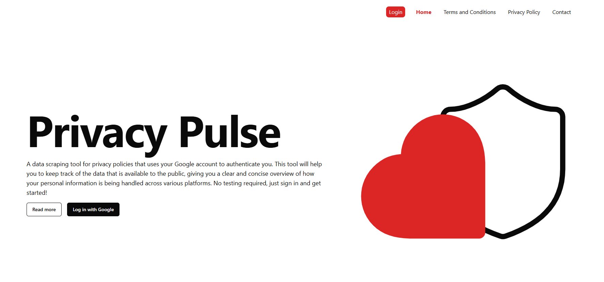{width=1331 height=621}

### Google Login Page
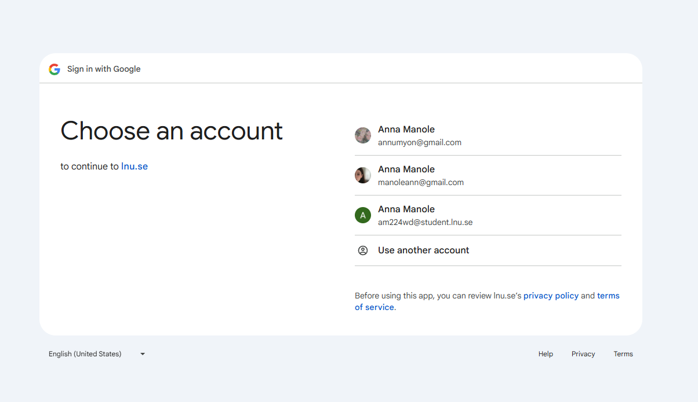{width=903 height=522}

### Deployed Account Overview and Scaping Service Functionality
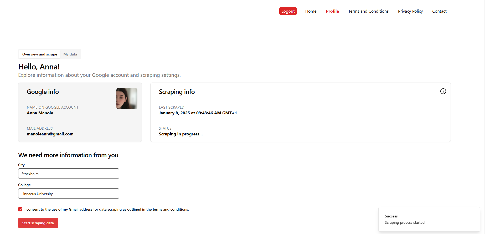{width=1385 height=668}

### Deployed User Data Tab
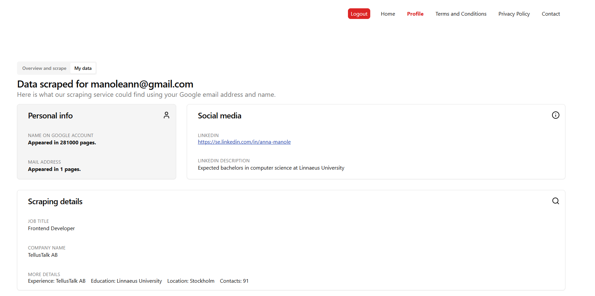{width=1341 height=668}

### 404 Page 
{width=1121 height=638}

### Responsive Layout
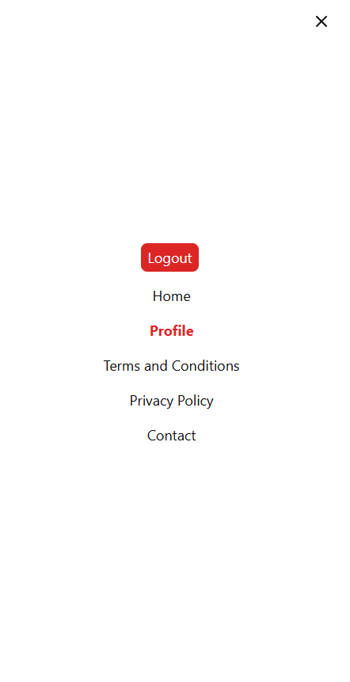{width=332 height=646}
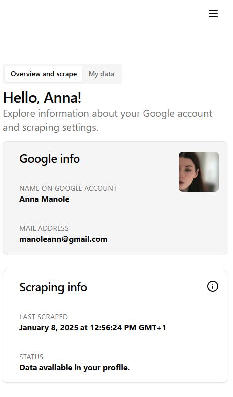{width=352 height=598}

## Architectural overview of the system

### User stories 

- As an end user, I  want to be able to log in into the App with my Google account ✅
- As an end user, I want to see my profile ✅
- As an end user, I want to be able see my data if it is available ✅
- As an end user, I want to be able to scrape public data associated with my Name and email ✅
- As an end user, want to be able to log out from the App ✅

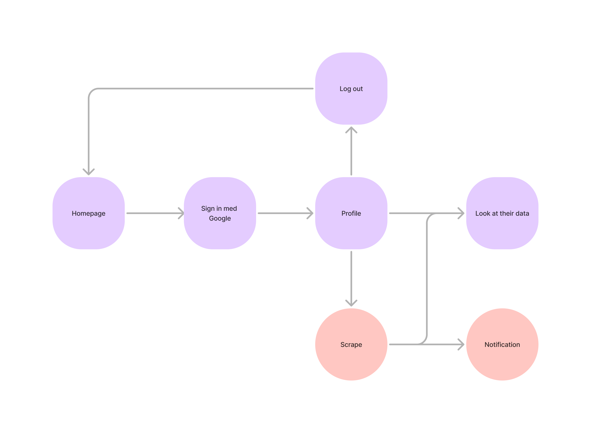

### Diagram

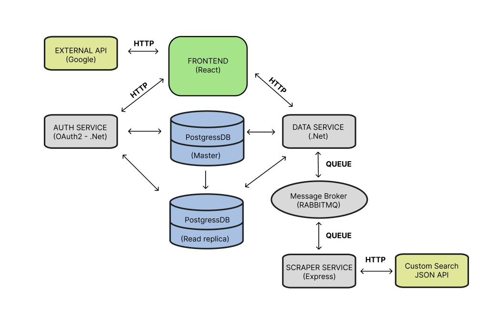{width=786 height=521}

## Microservices

- Frontend: Handles user interactions.
- Authentication Service: Manages authentication via OAuth2.
- Data Service: Processes and manages data.
- Data Scraper: Responsible for gathering external data.
- Supporting Components: Message Broker: Facilitates asynchronous communication.

## Communication protocols and patterns

### Synchronous Messaging Pattern (Request-Response)
Direct HTTP-based communication:
- Frontend → Data Service
- Frontend → Authentication Service
- Fronted → External API

### Asynchronous Messaging Pattern (Request-Reply)
Asynchronous communication with message queues:
- Data Service → Data Scraper
- Data Scraper → Data Service

## Data persistency

### Stack
- React: used for frontend.
- Express: used for scraper service.
- .NET: used for data service/OAuth service.
- Postgres: Centralized database for storing application data.

### Principle

Initially, we considered implementing CQRS with the Shared Database Pattern, where a single PostgreSQL instance would be used for both read and write operations.  However, we decided to adopt Classical CQRS with separate databases for read and write operations. This approach provides several advantages over the shared database pattern:

1. Decoupling and Scalability: By using separate databases, the read and write operations are fully decoupled. This allows database to be independently optimized for its specific workload, ensuring better scalability as the application grows.

2. Optimized for Read-Heavy Workloads: Our application has a higher number of read requests compared to write requests. 

3. Alignment with Microservices Architecture: Classical CQRS better aligns with a microservices approach by isolating the read and write models. This enables independent scaling, deployment, and maintenance, making the system more resilient and easier to evolve.

4. Reduced Contention: In a shared database, write-heavy operations can create contention that impacts read performance. By separating databases, we eliminate this bottleneck, ensuring that read and write workloads do not interfere with each other.

- Why PostgreSQL?
PostgreSQL was chosen as the database system for several reasons:

1. Reliability and Robustness: PostgreSQL is a battle-tested, ACID-compliant relational database that provides strong guarantees of data integrity and reliability, which are critical for our application.

2. Open-Source and Cost-Effective: As an open-source database, PostgreSQL is cost-effective and backed by a strong community, ensuring continued development and support.

3. Scalability: PostgreSQL scales well for both vertical and horizontal scaling needs, making it suitable for handling the increasing demand in our application.

By combining PostgreSQL's capabilities with a Classical CQRS approach, we can efficiently handle the application's read-heavy workload while maintaining scalability, reliability, and performance. This architecture ensures that our system can grow and adapt to future demands while providing a seamless user experience.

